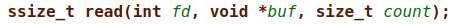

# ASM

## Overview

We're given an execution of a binary on port 9026, where we are asked to input shellcode.
The tricky part is that the shellcode can only use the syscalls of `open`/`read`/`write`.

In the home directory there is also a flag file, with a verrryyy long name - That won't be a problem for us!

## Solution

Intuivitely, what we'll want to do is this:

1. Open the flag file
2. Read the flag file
3. Write the content of the flag file into stdout

Simple right? Let's go over each step a little more in depth.

### Opening the file


The `open` syscall receives a path to the file, opens the file, and returns the fd of the opened file (in `rax`).

In order to open the file we need to store its name somewhere, we can easily store it on the stack using pwntools :)

```python
shellcraft.open("<path>")
```

And we won't have to deal with formatting the long name into the stack.

### Reading the file



Now that we have the file opened, we want to read into somewhere.
We can't read the file into another fd using only the read/write syscalls, but we can read the flag file into a buffer first!

Where can we create a buffer? In the stack, again :)
We'll just sub the `rsp` register by the flag size, which is basically like decalring a local variable.

Great, we have our own buffer on the stack with a known address. In order to use that address later, we'll keep it in `rbx` (since `rsp` constantly changes).

```
mov rbx, rsp
sub rsp, <flag_size>
```

Now all we have to do is to call the `read` syscall, very easy using pwntools.

Reminder: The fd of the opened file is at rax, since syscalls return value is stored at rax.

```python
shellcraft.read("rax", "rbx", 32)
```

### Writing to stdout


We're getting there!

Now we have the flag stored in a buffer with a known address, all we have to do is to write the buffer into stdout (fd=1).

```python
shellcraft.write(1, "rbx", 32)
```

And that's it!!!

Full code is also in the folder. I attached the assembly code and exe, it helps to debug it with gdb.

```
Mak1ng_shelLcodE_i5_veRy_eaSy
```