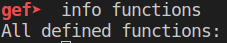

# Flag

## Overview

We're giving an executable named `flag`, the description for the challenge says it's a reversing challenge. Very well, let's try to analyze the binary!

Opening the binary in gdb shows no functions :0



And opening it up in ghidra shows a bunch of none-sense.

There's also another hint in the description - **packed** present!

## Packed Binaries

In short, packed binaries are compressed binaries. The packed binaries are smaller in size than the originals, and are also much harder to reverse engineer, as we've seen before. The most popular packer is UPX.

From the hint alone, we can assume that the binary is packed. But generally if we want to check if an elf file is UPX packed, we can check if `UPX` appears in the binary file:

```bash
grep UPX flag
```

Indeed the UPX appears in our file.

## Solution

Good news! Our program can be unpacked!

We need to install the [upx](https://upx.github.io/) program in order to unpack it.

```bash
Usage: upx [-123456789dlthVL] [-qvfk] [-o file] file..

Commands:
  -1     compress faster                   -9    compress better
  -d     decompress                        -l    list compressed file
  -t     test compressed file              -V    display version number
  -h     give more help                    -L    display software license
Options:
  -q     be quiet                          -v    be verbose
  -oFILE write output to 'FILE'
  -f     force compression of suspicious files
  -k     keep backup files
file..   executables to (de)compress
```

Let's decompress:

```bash
upx -d flag
```

Good! Now if we open the binary in gdb we'll be able to see the functions.

Going into main, we can see that the flag is being copeid into an allocated buffer. But the flag itself is static in the program:


The flag's pointer is at `0x6c2070`. Let's analyze the data:


There it is! Now all we have to do is to reverse the string in each word, I created a simple script:

```python
def rev_hex(s):
    s = s[2:]
    st = [s[x:x+2] for x in range(0, len(s), 2)]
    return ''.join(st[::-1])

hexes = [
    0x2e585055,
    0x203f2e2e,
    0x6e756f73,
    0x6c207364,
    0x20656b69,
    0x65642061,
    0x6576696c,
    0x73207972,
    0x69767265,
    0x3a206563,
    0x2e585055,
    0x203f2e2e,
    0x6e756f73,
    0x6c207364,
    0x20656b69,
    0x65642061,
    0x6576696c,
    0x73207972,
    0x69767265,
    0x3a206563
]

out = [rev_hex(hex(x)) for x in hexes]
out += [hex(0x29)[2:]]

out = [bytearray.fromhex(x).decode() for x in out]
print(''.join(out))
```

Ta Da!

`UPX...? sounds like a delivery service :)`