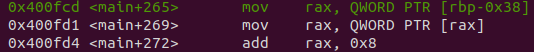
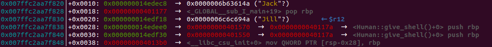
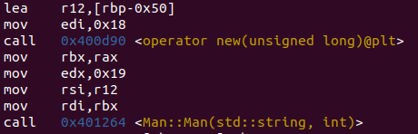

# Use After Free

## Intro

What's Use After Free (UAF)? This bug occures when allocated memory is not handled correcly.
More specifically, when we use memory which was already allocated, hence the name UAF.

For small amount of memory, the program uses a fast bin. The fast bin contains buckets for freed
chunks of the same size.

So when the program needs to allocate memory of a specific size, it checks
the fast bin for that size, and uses a freed chunk if available.

Each bucket in the fast bin uses the LIFO mechanism (like a stack), which basically means
that the last chunk freed will be the first one to be allocated.

Credit to this [nice article](https://infosecwriteups.com/arming-the-use-after-free-bc174a26c5f4).

## Inspection

So, we have been generously handed the source code - let's have a look at it.

Firstly, we can see that we have a base class called `Human`, which has a promising **virtual** method `give_shell` :).

We also have a virtual method of `introduce`, which is overriden in the derived classes `Man` and `Woman`.

### VTable

In order to succeed this challenge, we must understand how derived classes work.

A derived object's type and methods are dynamically set, at runtime. How does an object know which `introduce` method to access?

At creation, each object is also created a VTable. A pointer to that table is stored at offset 0 of the object.
The VTable contains a pointer to the correct instance of the virtual method, and contains the type of the object.

```
 _______________________
|   Woman VTable        |
|                       |
|   introduce: ----------------------> Woman::introduce()
|                       |
|   give_shell: ---------------------> Human::give_shell()
|_______________________|

 _______________________
|   Human VTable        |
|                       |
|   introduce: ----------------------> Human::introduce()
|                       |
|   give_shell: ---------------------> Human::give_shell()
|_______________________|
```

## Further Inspection

The while loop gets us a sort of menu, in which we can:

1. **Use** the `Man` and `Woman` objects created, while calling `introduce`
2. Allocate data **after** the objects were freed
3. **Free** the objects

Our goal is to somehow trigger `give_shell` from `introduce`

If we'll look closely at the assembly code, we can see that the program firstly looks up the VTable of the object:



and then accesses `introduce` which is at offset 8 in the VTable.

We can also see the addresses of the VTables:



For `Man` it's `0x401570`, for `Woman` it's `0x401550`.

Noise!! Now for the part where we abuse UAF.
If you look again at the loop, you'll notice that we can delete `m` and `w` and then use them although they were alredy freed.

When we choose option 3, both chunks of `m` and `w` will go into the fast bin:

```
 ___  <------- Top of the bin
| w |
| m |
|___|
```

Where `w` will be the next chunk used, and `m` the second one.

When we allocate data using option 2, `w` will point to the allocated data, but in option 1, `m` is used
before `w`, so we would like `m` to point to the data.

To do that we can just allocate again, `m` will now point to the data.

In step 2 we have the option to choose any data of any length to be `m`. We must allocate data
of the same size as `m` - A quick check shows us that it's allocated by 24 bytes:



Now, the actual data. As said before, we want that `introduction` will somehow lead to `give_shell`.
Meaning, the offset of 8 at the VTable of `m` will point to `give_shell`.

In order to do that, we can just pass the VTable, but with a negative offset of 8.

```
 ________________________
|   Man VTable           |
|                        |
| 0x401570:  give_shell  ---------------------> Human::give_shell()
|                        |
| 0x401578  introduction ---------------------> Man::introduction()
|________________________|
```

So we'll just set the VTable pointer to be `(0x401570- 8)`. Then, the offset of 8 will be `0x401570`.

## Solution

Final code can be found in this folder :)

Finally:

`yay_f1ag_aft3r_pwning`

Yay indeed.
